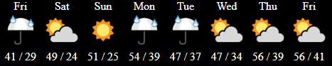

# DarkSky Weather API PHP plug-in with MySQL caching of forecast data
PHP code for pulling Weather Forecasts from the DarkSky Weather API and caching the data in MySQL

This code was developed to be used as an include which will display the forecast for the next 8 days.  In the code you'll need to leverage the DarkSky forecast API which returns JSON, this then gets parsed by PHP and cached in a MySQL database so you dont have to go out to the API each time a page is refreshed.

There are 2 pages included:
<ul>
    <li>weather.php - a script meant to be included in your page(s) where you want the forecast to appear</li>
    <li>weatherupdate.php - a script that when called will refresh the cached data, the intent here is that you would use something like a cron job to call this script on the frequency you prefer</li>
</ul>

The DarkSky API can be found here, you'll need to get your own API key:
https://darksky.net/dev

NOTE: You will need to manually add a location record to the weather table in MySQL where the 'location' column matches the location id you specify in the php.  The name you use is arbitrary, but needs to match on both ends.  The idea with this is that you could cache weather data from multiple locations if you desired.  If you skip this step it will not be able to determine when the last update occured and you will get an error.
